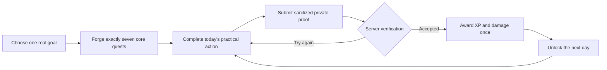

<div align="center">

# LifeQuest

### Turn one meaningful goal into a focused seven-day adventure.

LifeQuest combines practical daily actions with a calm, dark-fantasy RPG layer. Forge seven quests, submit private proof, earn server-authoritative XP, weaken a symbolic enemy, and finish what you started.

[](https://nextjs.org/)
[](https://nodejs.org/)
[](https://www.typescriptlang.org/)
[](https://platform.openai.com/)

[Game loop](#the-adventure-loop) · [Features](#release-1-trust-foundation) · [Run locally](#run-locally) · [Privacy](docs/PRIVACY_AND_PROOF_FLOW.md) · [Roadmap](docs/LIFEQUEST_V2_ROADMAP.md)

</div>

<div align="center">
  
  <br />
  <sub>Goal onboarding → seven-day campaign → private proof → verified progression → hero customization</sub>
</div>

## The adventure loop



The fantasy framing supports the work; it never replaces clear practical instructions.

## Release 1 trust foundation

| Capability | What it guarantees |
| --- | --- |
| Verification leases and receipts | One submission cannot be evaluated concurrently. Accepted and rejected terminal receipts are reusable and immutable. |
| Server-authoritative progression | XP, levels, enemy damage, unlocks, and victory events are applied in one row-locking, service-role-only database function. |
| Seven-day contract | Zod and Postgres enforce seven ordered core quests, unique days and titles, bounded time/rewards, and a Day 7 boss for new V2 campaigns. |
| Safe proof processing | The server validates signatures, decodes files with Sharp, removes metadata, corrects orientation, bounds dimensions, and stores only normalized JPEG output. |
| Private proof lifecycle | Proofs use a private user/campaign/quest path, can be deleted immediately, and expire through a protected retention job. |
| Generation cost guard | A generation key is claimed before the model call, so browser retries cannot create or pay for duplicate campaigns. |
| Usage controls | Privacy-safe, user-scoped monthly counters cover generation, moderation, proof verification, narration, and future adaptive generation. |
| Accurate Hero record | Lifetime aggregates come from a secure aggregate function, while campaign history is independently paginated. |
| Deterministic demo | Presentation mode is explicitly enabled and labelled; it never presents seeded results as live AI. |

## Product experience

- Original dark storybook interface with a connected campaign map, enemy health, hero XP, achievements, and responsive mobile navigation.
- Five realm themes and hero archetypes, earned titles, accents, high contrast, larger text, compact density, and reduced-motion support.
- Structured OpenAI campaign generation and proof verification with bounded schemas.
- Server-mediated Realtime quest narration; the API key never reaches the browser.
- Clear accepted and rejected requirement assessments with privacy-safe AI receipts.
- Keyboard-friendly dialogs, visible focus, semantic form controls, and layouts designed down to 320px.

<details>
<summary><strong>Seeded demonstration realm</strong></summary>

<div align="center">
  <br />
  
  <br />
  <sub>The Kingdom of Python is deterministic demonstration content.</sub>
</div>

</details>

## Architecture

| Boundary | Technology and responsibility |
| --- | --- |
| Web application | Next.js 16 App Router, React 19, strict TypeScript |
| UI | Tailwind CSS 4 plus semantic product CSS, Framer Motion, Lucide |
| Identity and data | Supabase Auth, Postgres, RLS, private Storage |
| AI | OpenAI Responses API, Structured Outputs, image moderation, Realtime |
| Validation | Zod at browser, route, database-result, and AI boundaries |
| Tests | Vitest, Testing Library, SQL contract tests, Playwright |
| Deployment target | Vercel on Node 22 |

See [LifeQuest V2 Architecture](docs/LIFEQUEST_V2_ARCHITECTURE.md) for the trust boundaries and request sequences.

## Run locally

### Prerequisites

- Node.js 22
- npm
- Supabase and OpenAI credentials only for the live path

```bash
git clone https://github.com/Munity16/LifeQuest.git
cd LifeQuest
npm ci
cp .env.example .env.local
npm run dev
```

Windows PowerShell:

```powershell
Copy-Item .env.example .env.local
npm.cmd ci
npm.cmd run dev
```

Open [http://localhost:3000](http://localhost:3000). The app builds without live credentials. Set `DEMO_MODE_ENABLED=true` only when the visibly labelled seeded demo is intended. Never commit `.env.local`.

## Configuration

| Variable | Scope | Purpose |
| --- | --- | --- |
| `NEXT_PUBLIC_APP_URL` | Required | Canonical origin for auth callbacks |
| `NEXT_PUBLIC_SUPABASE_URL` | Live | Browser-safe Supabase project URL |
| `NEXT_PUBLIC_SUPABASE_ANON_KEY` | Live | Browser-safe anonymous key; RLS remains mandatory |
| `SUPABASE_SERVICE_ROLE_KEY` | Live, server only | Controlled mutation and operational functions |
| `OPENAI_API_KEY` | Live, server only | OpenAI credential |
| `OPENAI_MODEL` | Live | Structured generation and verification model |
| `OPENAI_MODERATION_MODEL` | Live | Image safety model |
| `OPENAI_REALTIME_MODEL` | Live voice | Quest narration model |
| `AI_MONTHLY_*_LIMIT` | Live | Per-operation monthly request ceilings |
| `DEMO_MODE_ENABLED` | Demo | Must be exactly `true` to enable seeded behavior |
| `RATE_LIMIT_SALT` | Production | Secret salt for hashed rate-limit subjects |
| `CRON_SECRET` | Production | Protects proof-retention cleanup |
| `PROOF_RETENTION_DAYS` | Production | Proof-object lifetime; defaults to 30 days |
| `TELEMETRY_ENABLED` | Optional | Enables privacy-safe operational events |

Run `npm run validate:production` in a configured production environment.

## Database setup

Apply every SQL file in `supabase/migrations` in filename order:

1. `202607170001_initial_schema.sql`
2. `202607170002_secure_server_mutations.sql`
3. `202607190003_profile_appearance.sql`
4. `202607190004_production_hardening.sql`
5. `202607230005_v2_trust_correctness.sql`

The second migration removes the browser-callable legacy progression grant. The fifth adds verification/generation leases, V2 quest validation, lifetime aggregates, and user-scoped AI usage records. Do not skip or reorder migrations.

With a linked Supabase project:

```bash
supabase db push
```

Before launch, complete the [Live Readiness Checklist](docs/LIVE_READINESS_CHECKLIST.md).

## Proof privacy

1. The browser uploads a supported image of at most 5 MB.
2. The server checks its MIME type and byte signature.
3. Sharp decodes, rotates, bounds, and re-encodes it without EXIF/GPS metadata.
4. Only the sanitized JPEG is written to private Storage.
5. The sanitized image is sent to the configured AI provider for safety and quest-only evaluation.
6. The user can delete the image while the decision receipt and earned progression remain.

Read the [full proof flow](docs/PRIVACY_AND_PROOF_FLOW.md) or the in-app `/privacy` page.

## Quality gate

```bash
npm ci
npm run lint
npm run typecheck
npm run test
npm run test:e2e
npm run build
```

CI uses Node 22 and uploads Playwright diagnostics when the browser suite fails. Live checks are a separate, manually triggered staging workflow and are skipped unless `LIVE_E2E=true` plus staging credentials are supplied.

## Deployment

1. Import the repository into Vercel and select Node 22.
2. Add production environment variables; never prefix server secrets with `NEXT_PUBLIC_`.
3. Apply all five migrations to the target Supabase project.
4. Add the HTTPS `/auth/callback` URL to the Supabase redirect allowlist.
5. Confirm RLS, private bucket policies, cron secret, and retention schedule.
6. Run `npm run validate:production`, deploy, then execute the staging live-readiness workflow.
7. Keep demo mode disabled unless its visible demonstration label is intentional.

No live deployment is claimed by this repository.

## Roadmap and limitations

Release 1 addresses local trust and correctness. The Today dashboard, multiple completion methods, lifecycle controls, Daily Training, Chronicle, coins, domains, and grounded companion belong to later releases and are not represented as complete. See [LifeQuest V2 Roadmap](docs/LIFEQUEST_V2_ROADMAP.md).

Live Supabase, Storage, OpenAI, RLS-isolation, and Vercel behavior still require target credentials and an isolated staging deployment. Private proof-evaluation images and reports are intentionally excluded from Git.

<div align="center">

**Choose a goal. Begin the quest. Finish the seven-day path.**

</div>
