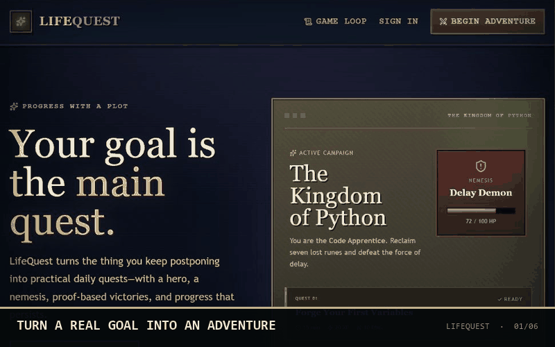
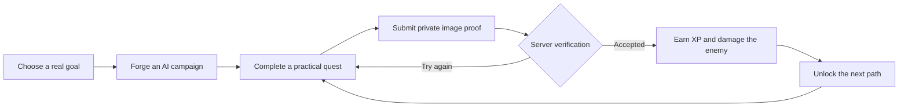

<div align="center">

# LifeQuest

### Turn a real goal into an adventure you can finish.

LifeQuest transforms practical goals into focused role-playing campaigns. Complete quests, submit private proof, defeat the obstacle standing in your way, and watch your hero grow.

<a href="https://nextjs.org/"><kbd>Next.js 16</kbd></a>
<a href="https://www.typescriptlang.org/"><kbd>TypeScript · strict</kbd></a>
<a href="https://platform.openai.com/"><kbd>OpenAI · Responses API</kbd></a>
<a href="#quality-gate"><kbd>✓ 64 tests</kbd></a>

[Explore the game loop](#the-adventure-loop) · [View features](#what-awaits) · [Run locally](#quick-start) · [Deploy](#deployment)

</div>

<div align="center">



<sub>Goal onboarding → campaign map → private proof → progression → hero customization</sub>

</div>

<details>
<summary><strong>Enter the seeded realm</strong></summary>

<br />

<div align="center">


<sub>The Kingdom of Python—the deterministic demonstration campaign.</sub>

</div>

</details>

---

## The adventure loop



The progression path is intentionally focused:

1. Sign in or enter the explicitly enabled seeded demo.
2. Describe a goal, available daily time, main obstacle, and preferred difficulty.
3. Generate and atomically save a campaign with practical quests.
4. Complete a quest and upload private screenshot or image proof.
5. Verify the proof on the server against every success requirement.
6. Apply XP, level, and enemy-health progression exactly once.
7. Reload and continue from the same saved state.

## What awaits

| | Experience |
| --- | --- |
| 🗺️ **AI-forged campaigns** | GPT-5.6 turns goals and constraints into a hero, nemesis, story, and bounded practical questline. |
| ⚔️ **Visible progression** | XP, levels, enemy health, completion history, achievements, and a connected adventure map make progress tangible. |
| 🔎 **Explainable proof checks** | Every accepted or rejected result includes requirement-by-requirement reasoning and a privacy-safe verification receipt. |
| 🛡️ **Server-authoritative rewards** | Browsers never decide XP or damage. Progression runs through an idempotent, row-locking database function. |
| 🎙️ **Quest narration** | Server-mediated OpenAI Realtime narration keeps credentials off the client; demo speech is clearly labelled device audio. |
| 🎨 **Hero Workshop** | Choose from five realm themes, five archetypes, earned titles, crests, accents, and accessibility preferences. |
| 📱 **Responsive adventure UI** | Keyboard support, visible focus, reduced motion, semantic controls, and layouts tested down to 320px. |
| 🧪 **Reliable presentation mode** | Deterministic accepted and rejected proof samples demonstrate the full loop without presenting simulated behavior as live AI. |

## Choose your hero

<div align="center">

| Scholar | Knight | Mage | Ranger | Rogue |
| :---: | :---: | :---: | :---: | :---: |
|  |  |  |  |  |

</div>

Hero settings preview instantly and apply across the profile, campaign HUD, quest screens, narration controls, and victory feedback. Live users store preferences on their RLS-protected profile; the seeded demo uses a private HTTP-only cookie.

## Technology

| Layer | Technology |
| --- | --- |
| Application | Next.js 16 App Router, React 19, strict TypeScript |
| Interface | Tailwind CSS 4, product-specific responsive CSS, Framer Motion, Lucide icons |
| Data and authentication | Supabase Postgres, Authentication, Row Level Security, private Storage |
| Intelligence | OpenAI JavaScript SDK, Responses API, GPT-5.6, image input, Structured Outputs, Realtime API |
| Validation and forms | Zod, React Hook Form |
| Quality | Vitest, Testing Library, SQL security-contract tests, private proof-evaluation runner |
| Hosting target | Vercel |

## Quick start

### Prerequisites

- Node.js 20.19 or newer
- npm
- A Supabase project for the live path
- An OpenAI API key with access to the configured models for the live path

### Install and run

```bash
git clone https://github.com/Munity16/LifeQuest.git
cd LifeQuest
npm install
cp .env.example .env.local
npm run dev
```

Open [http://localhost:3000](http://localhost:3000).

On Windows PowerShell:

```powershell
Copy-Item .env.example .env.local
npm.cmd install
npm.cmd run dev
```

LifeQuest builds without live credentials. Configure `.env.local` for the live path, or explicitly enable the labelled seeded demo. Never commit `.env.local`.

## Configuration

<details>
<summary><strong>Environment variables</strong></summary>

| Variable | Required | Purpose |
| --- | --- | --- |
| `NEXT_PUBLIC_APP_URL` | Yes | Canonical application origin used for authentication callbacks. |
| `NEXT_PUBLIC_SUPABASE_URL` | Live path | Supabase project URL; safe for browser use. |
| `NEXT_PUBLIC_SUPABASE_ANON_KEY` | Live path | Supabase anonymous key; safe for browser use when RLS is enforced. |
| `SUPABASE_SERVICE_ROLE_KEY` | Live path | Server-only key for controlled campaign, submission, and progression mutations. |
| `OPENAI_API_KEY` | Live path | Server-only OpenAI credential. |
| `OPENAI_MODEL` | Live path | Defaults to `gpt-5.6`. |
| `OPENAI_MODERATION_MODEL` | Live path | Defaults to `omni-moderation-latest` for proof-image safety screening. |
| `OPENAI_REALTIME_MODEL` | Live voice | Defaults to `gpt-realtime-2.1` for quest narration. |
| `DEMO_MODE_ENABLED` | Demo only | The seeded fallback exists only when this value is exactly `true`. |
| `DEMO_USER_EMAIL` | Optional | Reserved for a separately managed demo account. |
| `DEMO_USER_PASSWORD` | Optional | Reserved server-side for a separately managed demo account. |
| `RATE_LIMIT_SALT` | Production | Server-only random value, at least 32 characters, used before hashing rate-limit identifiers. |
| `CRON_SECRET` | Production | Server-only random value, at least 32 characters, protecting the retention cleanup route. |
| `PROOF_RETENTION_DAYS` | Production | Number of days to retain proof objects; defaults to `30`. |
| `TELEMETRY_ENABLED` | Optional | Set to `false` to disable privacy-safe operational event persistence. |

Live endpoints return explicit configuration errors when their required server credentials are absent.

</details>

<details>
<summary><strong>Supabase migrations and policies</strong></summary>

Apply the migrations in `supabase/migrations` in order:

1. `202607170001_initial_schema.sql`
   - Creates profiles, campaigns, quests, submissions, progress events, RLS policies, and the private `quest-proofs` bucket.
2. `202607170002_secure_server_mutations.sql`
   - Adds idempotent campaign creation and replaces progression with atomic, service-role-only database functions.
3. `202607190003_profile_appearance.sql`
   - Adds validated JSON appearance preferences to the user's RLS-protected profile.
4. `202607190004_production_hardening.sql`
   - Adds proof-deletion receipts, hashed service-only API rate limits, and privacy-safe operational events.

If the project is linked with the Supabase CLI:

```bash
supabase db push
```

Alternatively, run each migration in order in the Supabase SQL Editor. Do not skip the second migration: it removes the browser-callable progression permission present in the initial scaffold.

Confirm before going live:

- RLS is enabled on all public tables.
- Users can read only their own records.
- Only `service_role` can execute `create_campaign_with_quests` and `complete_quest`.
- Only `service_role` can consume the database-backed API rate limiter or write operational events.
- The proof bucket is private, limited to 5 MB JPG/PNG/WebP files, and scoped to `{userId}/{campaignId}/{questId}/{filename}`.
- Local and production `/auth/callback` URLs are present in the Supabase redirect allowlist.

</details>

## System boundaries

### Proof verification

The live verification path uses the official OpenAI JavaScript SDK:

1. Validate the private file path, declared MIME type, byte signature, size, quest ownership, and quest state.
2. Moderate the image before assessment.
3. Send the task requirements and high-detail private image to GPT-5.6.
4. Parse a bounded Zod Structured Output with a verdict and assessment for every requirement.
5. Reject low-confidence or incomplete results.
6. Apply rewards through the idempotent service-role progression function.

Receipts expose mode, model, latency, safety outcome, schema state, and application trace ID without logging proof bytes, data URLs, secrets, or private model reasoning.

### Production protection and privacy

- Authentication, generation, proof upload/verification/deletion, and narration routes enforce per-window limits. Production identifiers are salted and SHA-256 hashed before storage.
- Operational events use an allowlisted schema containing event type, status, latency, error code, model, and numeric/boolean metadata only—never raw IPs, emails, user IDs, goals, prompts, or proof content.
- Users can delete a stored proof immediately without removing the verification receipt or earned progression.
- Vercel invokes the protected retention route daily; proof objects older than `PROOF_RETENTION_DAYS` are removed in bounded batches.

### Campaign generation

Campaign generation uses `responses.parse` with `zodTextFormat`, bounded retries, consecutive quest validation, difficulty-specific reward bands, and an atomic campaign-and-quest database function.

### Narration

The browser sends a WebRTC offer to a server route that authorizes the OpenAI Realtime session. The OpenAI API key never reaches the browser, and no microphone permission is required.

## Seeded demo mode

Enable the labelled fallback only where it is intended:

```env
DEMO_MODE_ENABLED=true
```

The seeded demo:

- Loads a pre-generated **Kingdom of Python** campaign.
- Stores progress and appearance settings in private HTTP-only cookies for eight hours.
- Provides deterministic accepted and rejected proof samples generated in the browser.
- Offers a one-click reset for demo progression.
- Uses clearly labelled device speech instead of calling OpenAI Realtime.
- Never describes fallback behavior as live AI.

For a live demonstration, configure Supabase and OpenAI, sign in with a real test account, and disable demo mode.

## Quality gate

```bash
npm run lint
npm run typecheck
npm run test
npm run test:e2e
npm run build
```

The automated suite currently contains **68 passing Vitest tests** plus Chromium coverage for the complete seeded golden path and 320px campaign/quest layouts. GitHub Actions runs the strict quality gate and browser suite on every pull request and push to `main`.

### Private proof evaluation

The repository includes an eight-case JSONL manifest without proof files. Validate it with:

```bash
npm run eval:proof:validate
```

To run a live private evaluation, add sanitized images under the Git-ignored `evals/proofs/` directory, configure `OPENAI_API_KEY`, and run:

```bash
npm run eval:proof -- --output evals/reports/proof-verification.json
```

Proof images and generated reports remain ignored. No live evaluation score is claimed until the private image set and production account have been exercised.

## Deployment

1. Import the repository into Vercel as a Next.js project.
2. Keep the default build command: `npm run build`.
3. Configure production environment variables without exposing server secrets through `NEXT_PUBLIC_` names.
4. Set `NEXT_PUBLIC_APP_URL` to the final HTTPS origin.
5. Apply all four Supabase migrations.
6. Add the production `/auth/callback` URL to the Supabase redirect allowlist.
7. Confirm the storage bucket and RLS policies.
8. Run `npm run validate:production` in the configured production environment.
9. Deploy and run the manual verification checklist below with a fresh test user.
10. Disable demo mode for normal production use unless the visibly labelled fallback is intentional.

**Live URL:** not assigned in this repository yet; add the final Vercel HTTPS origin here and to the GitHub About section after the external project is created.

<details>
<summary><strong>Manual live verification checklist</strong></summary>

1. Create and confirm a test account.
2. Submit “Learn Python fundamentals in seven days” with 30 minutes, Procrastination, and Balanced difficulty.
3. Confirm the campaign and quests exist in Supabase and survive refresh.
4. Upload a supported private proof image under 5 MB.
5. Confirm its storage path and ownership scope.
6. Verify the proof and confirm exactly one XP award, one health reduction, and one completion event.
7. Retry the verification request and confirm progression does not change.
8. Sign in as another user and confirm the first user's records and proof object remain inaccessible.
9. Delete the stored proof and confirm the receipt and progression remain while the private object no longer downloads.
10. Trigger the `Live readiness` GitHub workflow against staging and confirm authentication, generation, persistence, and refresh.

</details>

## Current limitations

- Live OpenAI, Supabase, storage, RLS, and Vercel behavior still require verification against the target services and credentials.
- The private proof-evaluation image set and live model scores are intentionally absent from the repository.
- Seeded demo progress uses HTTP-only cookies rather than Supabase.
- The scheduled retention route is implemented but cannot run until a Vercel project, `CRON_SECRET`, and the fourth migration are configured.
- Adaptive quest generation is best-effort and cannot block or undo progression.
- Authentication currently supports Supabase email and password.
- LifeQuest is a focused MVP, not a medical, financial, legal, or safety-critical task system.

## Roadmap

- Deploy the configured Vercel/Supabase/OpenAI staging environment and record the live golden-path results.
- Exercise the manual two-user RLS/storage isolation and accepted/rejected private proof pair.
- Evaluate adaptive quest quality against representative goals before enabling it broadly.
- Add the final deployment URL after the external Vercel project is assigned.

---

<div align="center">

**Choose a goal. Begin the quest. Defeat what stands in your way.**

</div>
