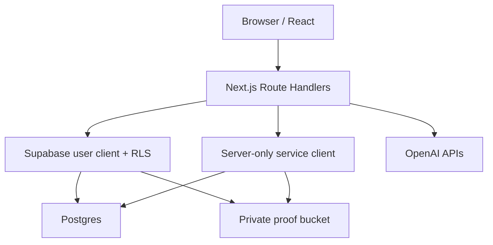

# LifeQuest V2 architecture

## Product boundary

LifeQuest turns one meaningful goal into one focused seven-day campaign. The protected golden path is:

`onboarding → campaign → quest → completion proof → verification → progression`

Social feeds, payments, marketplaces, unrestricted chat, and broad life tracking are outside this product.

## Runtime boundaries



- Browser code may send goals, proof files, and preferences. It never supplies trusted XP, damage, level, or completion state.
- Authenticated Supabase reads rely on RLS and `auth.uid()`.
- The service-role client exists only in server-only modules and calls narrowly scoped mutation functions.
- OpenAI output is untrusted until it passes Zod validation and server policy checks.
- Demo behavior requires `DEMO_MODE_ENABLED=true` and is labelled as deterministic.

## Verification state machine

```text
pending ──claim──> processing ──accepted──> accepted
                       └───────rejected──> rejected
                       └────────failure──> failed ──retry claim──> processing
```

`claim_quest_verification` row-locks the submission. A fresh processing lease returns HTTP 202 to concurrent callers. Terminal rows return the stored public receipt without downloading proof or calling AI. An accepted assessment is saved before the progression transaction; if persistence fails, a later lease can finish from that assessment without another model call.

`complete_quest` locks the submission, quest, campaign, and profile; validates the lease; applies XP/damage/unlock/event updates; and writes the terminal receipt in one transaction. The browser cannot execute it.

## Campaign-generation state machine

`claim_campaign_generation` creates or locks `(user_id, generation_key)` before a model call. Succeeded keys return their campaign, active leases return HTTP 202, and failed/stale leases can be reclaimed within a bounded attempt count. `create_campaign_with_quests` atomically persists the campaign, seven quests, and succeeded request state.

## Seven-day contract

New V2 campaigns are validated at three levels:

- Zod: exact length, ordered days/sequences, unique titles, Day 7 boss, reward bands.
- Service: user daily-minute constraint and structured-output retry bounds.
- Postgres: the atomic mutation revalidates all fields; V2-only partial indexes protect day/title uniqueness.

Legacy quests retain `generation_contract_version=1`; new quests use version 2. This avoids rewriting existing user data while enforcing the stronger contract for all new campaigns.

## Proof lifecycle

The live route validates MIME, size, and signature, then Sharp performs a real decode, orientation correction, bounded resize, metadata-free JPEG encode, and output-size check. Only that normalized output is stored at:

`{userId}/{campaignId}/{questId}/{randomFilename}.jpg`

Deletion clears the object/path and records `proof_deleted_at`; it intentionally retains the privacy-safe verification receipt and progression.

## Operational data

- Rate-limit subjects are salted and hashed.
- Operational events accept allowlisted fields only.
- AI usage events store operation, model, available units, latency, status, optional estimated micro-USD, and trace ID.
- Goals, emails, reflections, raw IPs, proof bytes, data URLs, and private model reasoning must not enter telemetry.
